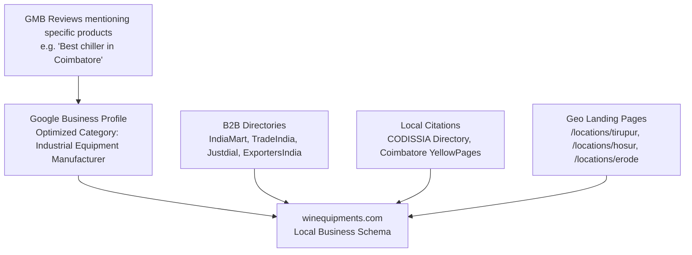

# Win Equipments — Comprehensive Site Context, Developer Handover & SEO Strategy Guide

> **Confidential & Comprehensive Handover Document**  
> **Target Audience:** UI/UX Designers, Frontend & Full-Stack Developers, and SEO Specialists.  
> **Client / Business:** Win Equipments ([winequipments.com](https://winequipments.com/))  
> **Prepared Date:** September 2026

---

## 1. Executive Summary & Business Profile

### 1.1 Business Identity
* **Company Name:** Win Equipments
* **Proprietor:** Mr. Ramasamy Ananthakumar
* **Business Type:** B2B Manufacturer, Supplier, and Exporter
* **Primary Industries Served:** Textiles (Knitting, Spinning, Weaving), Automotive & Ancillaries, CNC Machining, Food & Beverage Processing, Pharmaceuticals & Healthcare (MRI/CT cooling), Chemical, and Heavy Engineering.
* **Core Value Proposition / Tagline:** *"Save Water and Power"* — Delivering high-efficiency industrial cooling and compressed air treatment systems designed for tropical South Indian conditions (up to 50°C ambient).
* **Key Differentiator:** Unlike volume resellers, Win Equipments operates on a **"Project Consultancy"** model, designing custom tonnage and bespoke thermal systems (e.g., Soda Chillers, Medical Scan Chillers, Spot Chillers) tailored to factory layout and air quality requirements.
* **Certifications:** ISO 9001:2015, IAF Accredited, DAC Certified, GST Registered (`33AJWPA2797B1Z7`).
* **IndiaMart Presence:** Verified 15+ years supplier, 4.7/5 rating ([IndiaMart Profile](https://www.indiamart.com/winequipments/)).

### 1.2 Physical Locations & Contact Details
* **Registered Manufacturing Facility:** SF No: 4, 195 B, Post, Kallangadu, Arasur, Coimbatore, Tamil Nadu – 641407, India.
* *(Note on discrepancy)*: Older branch/premises mentioned in some schemas: SF No. 209/1B2, Near Hotel Alankar, Malumichampatti, Coimbatore, TN 641050. *(See Technical Debt section for cleanup instructions).*
* **Primary Phone:** `+91 95972 28969` / `+91 95972 28975`
* **Official Email:** `info@winequipments.com`
* **Lead Ingestion Email:** `devasahithiyan@gmail.com` (currently hooked into AJAX forms)

---

## 2. Technology Stack & Architecture

### 2.1 Current Architecture
The current website is a **multi-page static architecture (MPA)** using pure HTML5, CSS3, and JavaScript with jQuery and third-party UI animation libraries.

```
├── HTML5 (Semantic structure, rich JSON-LD Schema markup)
├── CSS3 (Custom design system in styles.css + product.css + installation.css)
├── JavaScript (ES6 + jQuery 3.6.0 for DOM manipulation, sliders, modals, animations)
├── Third-Party Libraries (CDN-loaded):
│   ├── jQuery v3.6.0
│   ├── Slick Carousel v1.8.1 (Product image carousels & client logo tickers)
│   ├── AOS (Animate On Scroll) v2.3.4
│   └── Font Awesome v6.4.0 (Icons)
├── Fonts:
│   ├── Google Fonts: Montserrat (Headings) & Open Sans (Body)
│   └── Mukta Malar (for /ta/ Tamil regional page)
└── Form Backend / Lead Pipeline:
    └── FormSubmit.co AJAX Endpoint (`https://formsubmit.co/ajax/devasahithiyan@gmail.com`)
```

### 2.2 Repository Directory Tree & File Inventory

```
/Users/devasahithiyan/Desktop/Win equipments/
│
├── index.html                   # Homepage (Hero, About summary, Products grid, Why Us, Testimonials, Form)
├── about.html                   # Company history, mission, infrastructure, and leadership
├── contactus.html               # Contact information, Google Maps embed, inquiry form
├── certifications.html          # ISO 9001:2015, IAF, DAC certifications showcase
├── installation.html            # Video guides, maintenance schedules, on-site service details
├── blog.html                    # Blog archive with category filter (#technical-guides, #maintenance, #applications)
├── robots.txt                   # Search crawler directives and sitemap declaration
├── sitemap.xml                  # XML sitemap covering 24 URLs (priority & changefreq mapped)
├── styles.css                   # Global styles & design system (~3,600 lines)
├── script.js                    # Global JS (Hero zoom parallax, counters, blog filters, dynamic quote modal)
├── navbar.js                    # Dynamic JS-rendered navigation bar across subdirectories
├── E_Catalogue.pdf              # Full product catalog for customer download
│
├── products/                    # Product Detail Pages (Pillar Pages with specs, 3D tilt, tabs)
│   ├── refrigerated_air_dryers.html  # Flagship: Refrigerated Air Dryers (20 CFM to 2000 CFM)
│   ├── cooling_towers.html           # FRP Round Bottle Cooling Towers (10 TR to 1500 TR)
│   ├── rounded_cooling_towers.html   # FRP Square Type Cooling Towers
│   ├── chiller.html                  # Industrial Chillers (Soda, Medical, Process, Scroll/Screw)
│   ├── air_receiver.html             # Vertical & Horizontal Air Receiver Tanks
│   ├── desiccant_air_dryer.html      # Heatless & Heated Desiccant Air Dryers (-40°C to -70°C dew point)
│   ├── compressed_air_filter.html    # Pre, Fine & Carbon Activated Coalescing Filters
│   ├── automatic_drain_valve.html    # Electronic Timer & Zero-Air-Loss Drain Valves
│   ├── aftercooler.html              # Air-Cooled & Water-Cooled Moisture Aftercoolers
│   ├── coil_cooling.html             # Closed-Circuit Coil Cooling Towers
│   ├── product.css                   # Product page specific styles (tabs, specs tables, 3D cards)
│   └── product.js                    # Slick gallery initialization & 3D mouse parallax logic
│
├── locations/                   # Geo-Targeted Programmatic Landing Pages (Local SEO)
│   ├── hosur-industrial-chillers.html       # Auto & Precision Engineering Hub
│   ├── tirupur-textile-air-dryers.html      # Textile Mills, Air Jet Looms & Autoconers
│   └── erode-cooling-towers.html            # Dyeing, Processing, and Tannery Units
│
├── blog/                        # High-Intent SEO Content & Buyer Guides
│   ├── what-is-refrigerated-air-dryer.html
│   ├── key-benefits-refrigerated-air-dryers.html
│   ├── refrigerated-vs-desiccant.html
│   ├── how-to-choose-dryer.html
│   ├── maintenance-tips-hot-climates.html
│   ├── troubleshooting-common-problems.html
│   ├── pricing-in-coimbatore.html
│   ├── save-energy-reduce-costs.html
│   ├── applications-textile-food.html
│   └── installing-servicing-tamil-nadu.html
│
├── ta/                          # Regional Vernacular Language Support
│   └── index.html               # Tamil landing page for local factory owners & SME buyers
│
├── Reports/                     # Historical Strategy & Competitor Analysis Reports
│   ├── SEO_STRATEGY.md          # On-page optimization & local SEO summary
│   ├── gemini.txt               # Comprehensive strategic rewrite & keyword density report
│   ├── chatgpt.txt              # Competitor analysis and content structure
│   ├── perplexity.txt           # Keyword intent analysis
│   └── deepseek.txt & grok.txt  # Strategic audits
│
└── images/                      # Image assets (Products, Hero banners, Client logos, Certifications)
```

---

## 3. Product Catalog & Core Specifications

The new developer must understand the technical distinctions between the product lines to build effective filters, sizing calculators, and quotation flows:

| Product Name | Core Function / Application | Key Specifications / Highlights |
| :--- | :--- | :--- |
| **Refrigerated Air Dryers** | Removes moisture from compressed air lines; prevents pneumatic corrosion. | • Capacity: 20 to 2000 CFM<br>• Pressure Dew Point: +3°C<br>• Eco Refrigerants: R134a, R407c<br>• Co-axial copper heat exchangers |
| **FRP Round Cooling Towers** | Evaporative heat rejection for industrial water circuits. | • Capacity: 10 TR to 1500 TR<br>• 360° uniform air intake<br>• Rotary nylon/brass sprinkler<br>• Honeycomb PVC fills |
| **Square Cooling Towers** | Modular cooling towers for space-constrained plants and rooftops. | • Space-saving rectangular footprint<br>• Multi-cell expandable modularity<br>• Fixed non-clogging gravity nozzles |
| **Industrial Chillers** | High-precision process cooling for fluids, lasers, and machinery. | • Types: Air-Cooled & Water-Cooled<br>• Specialized units: **Soda Chiller** (beverage), **Medical Scan Chiller** (MRI/CT), **Electroplating Chiller**, **Spot Chiller** (portable) |
| **Desiccant Air Dryers** | Ultra-dry compressed air for critical pharma, electronics, paint booths. | • Dew Point: -40°C down to -70°C<br>• Activated alumina / molecular sieve desiccant<br>• Dual tower cyclic adsorption |
| **Air Receiver Tanks** | Dampens compressor pulsations, acts as emergency air reserve buffer. | • Tested to IS 2825 / ASME standards<br>• Vertical and Horizontal variants<br>• Pressure ratings: 7 to 40 kg/cm² |
| **Air Filters & Aftercoolers** | Upstream & downstream filtration: oil mist, particulates, pre-cooling. | • Coalescing filters down to 0.01 micron<br>• Air & water-cooled aftercoolers reducing air temp from 120°C to 40°C |

---

## 4. UI/UX Developer Guide (Frontend & Design Overhaul)

### 4.1 Current Design System Variables
Located at the top of [styles.css](file:///Users/devasahithiyan/Desktop/Win%20equipments/styles.css#L1-L17):
```css
:root {
  --primary: #0056b3;       /* Industrial Royal Blue */
  --primary-dark: #003d82;  /* Deep Navy */
  --secondary: #00a8cc;     /* Cyan / Process Cooling Accent */
  --accent: #ff6b6b;        /* Coral Call-to-Action */
  --text-dark: #333333;
  --text-light: #666666;
  --white: #ffffff;
  --light-bg: #f4f7f6;
  --dark-bg: #1a1a1a;
  --font-heading: 'Montserrat', sans-serif;
  --font-body: 'Open Sans', sans-serif;
}
```

### 4.2 Interactive Elements & Existing JavaScript Features
1. **Dynamic Navigation (`navbar.js`):**
   * Computes directory depth (`../`) dynamically based on `window.location.pathname`.
   * Sets active navigation class based on route and hash.
   * Renders mobile slide-in drawer on `.menu-toggle` click.
2. **Dynamic Product Quotation Modal (`script.js`):**
   * Calling `openQuoteModal('ref_dryer')` dynamically populates form fields tailored to that product (e.g., CFM rating, compressor HP for air dryers; Tonnage/TR and target temp for chillers).
3. **Hero Banner Zoom Parallax (`script.js`):**
   * Uses `requestAnimationFrame` to smoothly scale `.hero-banner-img` from `1.2` to `1.0` during the first 600px of scroll.
4. **Counter Animations:**
   * Animates numbers for "15+ Years", "200+ Projects Done", "50+ Global Clients" when scrolled into view.
5. **Product Visual 3D Tilt (`product.js`):**
   * Mousemove listener calculates rotational angles (`rotateX`, `rotateY`) on the product image container for interactive depth.
6. **Blog Hash Filtering:**
   * Switching hashes (`#technical-guides`, `#maintenance`, `#applications`) filters visible `.blog-card` elements on `blog.html`.

### 4.3 UI Gaps & Enhancement Recommendations for the Designer/Developer
* **Eliminate Layout Shift (CLS) from Dynamic Navbar:**  
  * *Current Problem:* `navbar.js` generates the nav markup client-side, causing layout shift or a brief blank header on slower devices.
  * *Solution:* Either render a static semantic HTML `<header>` in every file (and use JS only for mobile toggle/active states), or migrate to a templated/component-based architecture (Next.js, Astro, or Eleventy).
* **Modernize Product Specification Tables:**  
  * On mobile devices, tables are currently horizontal-scroll containers. Build responsive comparison cards or a sticky first-column data table for mobile screens.
* **Interactive Sizing / Sizing Calculator:**  
  * Industrial buyers frequently ask: *"What CFM dryer do I need for my 30 HP compressor?"* or *"What TR chiller is needed to cool X liters of water from 40°C to 15°C?"*
  * Building a simple interactive **Equipment Sizing Calculator** on the homepage and product pages will dramatically increase time-on-site, user engagement, and qualified lead conversion.
* **Lead Capture Floating Widget Refinement:**  
  * The current sticky mobile bar (`Call`, `WhatsApp`, `Get Quote`) is effective for Indian B2B markets. Keep this high-converting pattern, but improve its styling with backdrop-blur glassmorphism.
* **Visual Asset Polish:**  
  * Convert all product PNG/JPG images to WebP format with crisp transparent backgrounds and shadow layers. Add subtle zoom-on-hover effects.

---

## 5. Programmer & Backend Guide (Forms, APIs & Modernization)

### 5.1 Form Handling & Lead Pipelines
Currently, there are three primary form endpoints:
1. **General Inquiry Form** (Homepage & Contact Page): Captured via `fetch()` and submitted via AJAX to `https://formsubmit.co/ajax/devasahithiyan@gmail.com`.
2. **Contextual Product Quote Modal** (`openQuoteModal()`): Injects dynamic fields into a modal form, submitted to the same FormSubmit endpoint.
3. **Direct Contact CTA Buttons**:
   * WhatsApp: Direct deep-links to `https://wa.me/919597228969?text=Hi%2C%20I%27m%20interested%20in...`
   * Phone: `tel:+919597228969`

### 5.2 Recommended Backend & Full-Stack Upgrades
1. **Replace FormSubmit.co with a Resilient Lead Pipeline:**
   * *Limitation:* FormSubmit has rate limits, occasional spam capture issues, and lacks an audit log of incoming customer enquiries.
   * *Upgrade Path:*
     * Build an API endpoint (e.g., using Cloudflare Workers, Next.js Server Actions, or an Express/Node backend).
     * Connect inquiries to a Google Sheets API or a database (Supabase / MongoDB) for permanent lead backup.
     * Trigger instant notifications via **WhatsApp Business Cloud API** or SMS to the sales manager whenever a high-intent quote is submitted.
2. **Clean Up Technical Debt & Clean Git Hygiene:**
   * **Remove large junk archives:** `winequipments.zip` (73 MB) and `__MACOSX.zip` (36 MB) are sitting directly in the web root! Delete or move them outside the public web folder immediately.
   * **Remove backup/test files:** `contactus_backup.html` and `minimal_test.html` should be removed from production to avoid accidental indexing or duplicate content flags.
   * **Deduplicate `<link rel="stylesheet">`:** Fix duplicate `styles.css` imports found in several product pages (e.g. `products/refrigerated_air_dryers.html` lines 34-35).
3. **Potential Framework Migration (Optional but Recommended):**
   * If the developer wishes to modernize the stack:
     * **Astro** or **Next.js (SSG)** is ideal: provides static HTML output for lightning-fast speeds and perfect SEO, while allowing reusable components (`<Navbar />`, `<ProductCard />`, `<QuoteModal />`) and eliminating JS path prefixes (`../`).

---

## 6. Comprehensive SEO Guide & Audit

### 6.1 Current SEO Health & Baseline Setup
* **Title Tags & Meta Descriptions:** Tailored with geographic keywords (`"Manufacturer in Coimbatore, Tamil Nadu"`).
* **Geotagging Metas:** `<meta name="geo.region" content="IN-TN" />`, `<meta name="geo.placename" content="Coimbatore, Tamil Nadu" />`, ICBM coordinates `11.0168, 76.9558` are already integrated.
* **Schema Markup (JSON-LD):** Extensive schema implemented:
  * `LocalBusiness` & `IndustrialBusiness` on `index.html`
  * `Product` & `AggregateOffer` on all product pages
  * `FAQPage` schema on `refrigerated_air_dryers.html`
  * `VideoObject` schema on `installation.html`
  * `ContactPage` schema on `contactus.html`
* **Sitemap & Robots:** Active [sitemap.xml](file:///Users/devasahithiyan/Desktop/Win%20equipments/sitemap.xml) and clean [robots.txt](file:///Users/devasahithiyan/Desktop/Win%20equipments/robots.txt).

### 6.2 Critical SEO Bugs To Fix Immediately (Day 1)

> [!CAUTION]
> **Bug 1: Conflicting Addresses in Schema Markup on Homepage**  
> On `index.html`, lines 46-50 declare the address as **Malumichampatti (641050)**, while lines 101-105 declare the address as **Arasur (641407)**.  
> *Google strictly validates NAP (Name, Address, Phone) consistency. Conflicting schemas dilute local search ranking and confuse Google Maps.*  
> **Fix:** Choose the single official registered address (SF No: 4, 195 B, Kallangadu, Arasur Post, Coimbatore - 641407) and harmonize it across all schemas, footer text, and Google Business Profile.

> [!WARNING]
> **Bug 2: Missing Self-Referencing Canonical Tags on Subpages**  
> `index.html` contains `<link rel="canonical" href="https://winequipments.com/" />`, but several product pages, blog articles, and location pages are missing their self-referencing canonical tags.  
> **Fix:** Add exact canonical URLs to all pages to prevent duplicate content indexing.

> [!WARNING]
> **Bug 3: Missing OpenGraph & Twitter Social Cards**  
> Most pages lack `og:title`, `og:description`, `og:image`, and `twitter:card`. When industrial buyers share links on WhatsApp or LinkedIn, rich previews do not render.  
> **Fix:** Add standardized OpenGraph meta blocks to all HTML heads with a 1200x630 branded preview image.

> [!IMPORTANT]
> **Bug 4: Missing Hreflang Tags for Tamil Regional Page**  
> The site features a dedicated Tamil page (`https://winequipments.com/ta/`), but neither `index.html` nor `ta/index.html` contains `rel="alternate" hreflang="ta"` / `hreflang="en"` tags.  
> **Fix:** Implement reciprocal hreflang tags:
> ```html
> <link rel="alternate" hreflang="en-IN" href="https://winequipments.com/" />
> <link rel="alternate" hreflang="ta-IN" href="https://winequipments.com/ta/" />
> <link rel="alternate" hreflang="x-default" href="https://winequipments.com/" />
> ```

### 6.3 Target Keyword Strategy & Content Silos

#### Primary High-Intent Commercial Keywords (Targeting Procurement & Plant Heads):
1. **Air Dryers:**
   * `"Refrigerated air dryer manufacturer in Coimbatore"`
   * `"Compressed air dryer supplier Tamil Nadu"`
   * `"Desiccant air dryer -40 dew point price India"`
   * `"Air dryer for textile spinning mill Tirupur"`
2. **Cooling Towers:**
   * `"FRP cooling tower manufacturer Coimbatore"`
   * `"Round bottle cooling tower Tamil Nadu"`
   * `"Square type cross flow cooling tower industrial"`
   * `"Cooling tower maintenance and fill replacement Coimbatore"`
3. **Industrial Chillers:**
   * `"Industrial water chiller manufacturer Coimbatore"`
   * `"Soda chiller machine manufacturer"`
   * `"Medical scan MRI chiller supplier South India"`
   * `"Electroplating bath chiller manufacturer"`
4. **Air Receivers & Accessories:**
   * `"Industrial air receiver tank manufacturer IS 2825"`
   * `"Automatic electronic drain valve for compressor"`

#### Informational & Blog Content Silos (Top of Funnel):
The 10 existing blog articles target the complete buyer journey:
* **Awareness:** *"What is a Refrigerated Air Dryer and How Does It Work?"*
* **Evaluation / Comparison:** *"Refrigerated vs Desiccant Air Dryer: Which is Right for You?"*
* **Purchase Decision:** *"Pricing Guide for Air Dryers in Coimbatore"* & *"How to Choose the Right Capacity Dryer (CFM)"*
* **Post-Purchase & Retention:** *"Maintenance Tips for Industrial Equipment in Hot & Humid Climates"* & *"Troubleshooting Common Compressor Moisture Issues"*

### 6.4 Local & Off-Page SEO Blueprint for Tamil Nadu



1. **Google Business Profile (GMB) Optimization:**
   * Primary Category: **Industrial Equipment Supplier** or **Industrial Equipment Manufacturer**.
   * Secondary Categories: **Air Compressor Supplier**, **HVAC Contractor**, **Mechanical Engineer**.
   * Products Section: Add all 10 products with photos, specs, and direct landing page links.
   * Review Solicitation: Request reviews from satisfied plant managers in Tirupur, Coimbatore, and Hosur that explicitly include keyword anchors (e.g. *"Great experience buying a 50 CFM refrigerated air dryer for our weaving unit"*).
2. **High-Authority Local & Industrial Citations:**
   * Maintain 100% NAP consistency on **IndiaMart**, **TradeIndia**, **Justdial**, **Sulekha**, and the **CODISSIA (Coimbatore District Small Industries Association)** directory.

---

## 7. Developer & SEO Master Action Checklist

### Phase 1: Immediate Fixes (Day 1 - Day 3)
- [ ] **Delete root ZIP files:** Remove `winequipments.zip` (73MB) and `__MACOSX.zip` (36MB).
- [ ] **Remove legacy files:** Delete `contactus_backup.html` and `minimal_test.html`.
- [ ] **Harmonize NAP & Schema:** Standardize address to Arasur (641407) across all JSON-LD schemas and footer text.
- [ ] **Fix CSS duplication:** Remove duplicate `<link rel="stylesheet">` tags across product pages.
- [ ] **Add missing Canonical tags:** Ensure every HTML file has its accurate canonical URL.
- [ ] **Add Hreflang tags:** Connect `index.html` and `ta/index.html` via `rel="alternate"`.
- [ ] **Add OpenGraph meta tags:** Add `og:title`, `og:image`, and `og:description` across all core pages.

### Phase 2: UI & UX Modernization (Weeks 1 - 2)
- [ ] **Static/Hybrid Navbar:** Replace client-side DOM injection with static HTML or SSR/SSG components to eliminate CLS.
- [ ] **Responsive Data Tables:** Optimize technical specification tables for mobile viewports.
- [ ] **Asset Optimization:** Compress all images and convert to next-gen WebP format with explicit width/height dimensions.
- [ ] **Interactive Sizing Calculator:** Build a CFM/Tonnage sizing helper tool to boost user engagement and generate inbound leads.
- [ ] **Refine Mobile Action Bar:** Enhance the floating WhatsApp/Call/Quote mobile dock with modern glassmorphism.

### Phase 3: SEO Growth & Lead Engineering (Month 1+)
- [ ] **Expand Geo-Pages:** Create additional regional landing pages for emerging industrial zones (e.g. `chennai-industrial-chillers.html`, `salem-steel-cooling-towers.html`, `madurai-food-chillers.html`).
- [ ] **Serverless Lead Pipeline:** Connect quote forms to a database/CRM and automate instant SMS/WhatsApp alerts for new inquiries.
- [ ] **GMB & Citation Building:** Align Google Business Profile categories, add product catalog to GMB, and ensure listing on CODISSIA and B2B directories.
- [ ] **Internal Linking Structure:** Ensure every blog article has in-text contextual links pointing to its corresponding product page with exact-match anchor text.

---
*Document prepared for Win Equipments. For any clarifications or codebase queries, refer to the local git history or project repository documentation.*
